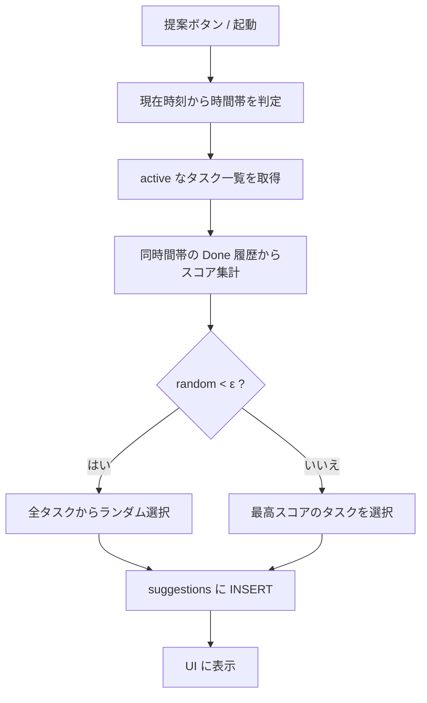

# 提案ロジック

やる気起こrunner は、**時間帯 × タスク**ごとの履歴から「やる気が出た率」を推定し、ε-greedy で次に提案するタスクを選びます。

## 概要

1. 現在のローカル時刻から時間帯（朝 / 昼 / 夜）を決める
2. 同じ時間帯で **Done 済み** の提案履歴からタスクごとのスコアを集計する
3. 確率 ε（現在 0.2）でランダム提案、それ以外は最高スコアのタスクを提案する
4. 選んだタスクを `suggestions` テーブルに記録する



## 時間帯

ローカル時刻の「時」（`Date#getHours()`）で判定します。

| 時間帯 | 条件（時） | 表示ラベル |
|---|---|---|
| morning | 5 ≤ hour < 12 | 朝 |
| afternoon | 12 ≤ hour < 18 | 昼 |
| evening | それ以外（0–4, 18–23） | 夜 |

履歴の時間帯は、各 `suggestions.suggested_at` を同じルールで分類します。

## データモデル

```sql
tasks(id, title, active)
suggestions(id, task_id, suggested_at, done_at, motivated)
```

| カラム | 意味 |
|---|---|
| `tasks.active` | 1 のタスクだけ提案候補 |
| `suggestions.suggested_at` | 提案した日時（ローカル時刻の ISO 風文字列） |
| `suggestions.done_at` | Done した日時。未 Done は NULL |
| `suggestions.motivated` | Done 時に「やる気が出た」なら 1、そうでなければ 0。未 Done は NULL |

**学習に使うのは `done_at IS NOT NULL` の行だけ**です。提案しただけではスコアに反映されません。

## スコア（やる気が出た率）

時間帯ごとに、タスク t のスコアを次で定義します。

```
rate(t) = motivated_count(t) / done_count(t)
```

- `done_count`: その時間帯で Done した回数
- `motivated_count`: そのうち `motivated = 1` だった回数

履歴がないタスク（`done_count = 0`）は **0.5** を仮スコアとして扱います。新しいタスクや未試行タスクにも提案機会を残すためです。

## ε-greedy

定数（実装値）:

| 定数 | 値 | 意味 |
|---|---|---|
| `EPSILON` | 0.2 | 探索（ランダム提案）の確率 |
| `DEFAULT_MOTIVATED_RATE` | 0.5 | 履歴なしタスクの仮スコア |

アルゴリズム:

1. `u ~ Uniform(0, 1)` を生成
2. `u < ε` なら、アクティブなタスクから一様ランダムに 1 件選ぶ（**探索**）
3. そうでなければ、`rate(t)` が最大のタスクを選ぶ（**活用**）。同率のタスクが複数ある場合はその中からランダム

擬似コード:

```
if random() < EPSILON:
  return random_active_task()
else:
  return argmax_t rate(t)  # 同率はランダム tie-break
```

## 提案の記録

タスクが選ばれたら、即座に次を INSERT します。

```sql
INSERT INTO suggestions (task_id, suggested_at) VALUES (?, ?)
```

`done_at` と `motivated` は、ユーザーが Done / 「やる気が出た Done」を押したときに更新されます。

## 実装ファイル

| ファイル | 役割 |
|---|---|
| [`src/timeBand.ts`](../src/timeBand.ts) | 時間帯判定・ローカル日時フォーマット |
| [`src/suggestLogic.ts`](../src/suggestLogic.ts) | スコア計算・ε-greedy 選択（純粋関数） |
| [`src/suggest.ts`](../src/suggest.ts) | SQLite からの履歴読み込み・提案の永続化 |
| [`src/main.tsx`](../src/main.tsx) | 提案の表示・「別の提案」ボタン |

## 今後の拡張

- 時間帯の境界や ε を設定で変えられるようにする
- Thompson sampling など別のバンディット手法への差し替え
